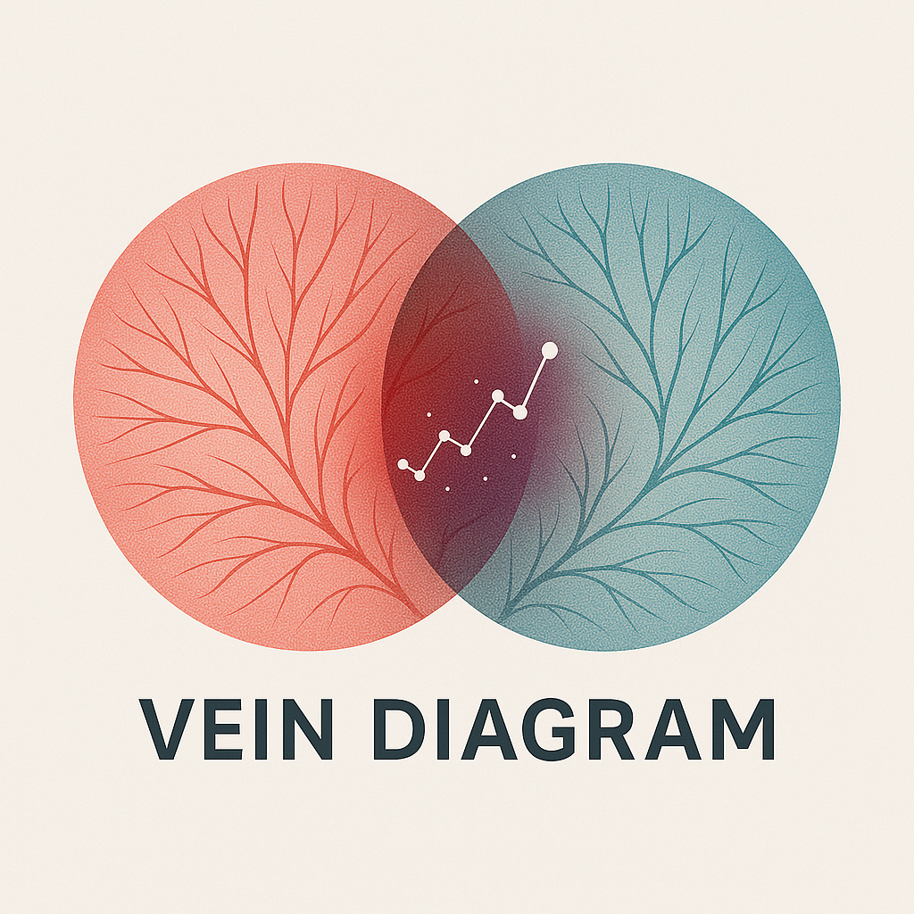

# Vein Diagram

<div align="center">
  
</div>

Vein Diagram transforms blood test PDFs into insightful visualizations, helping users track biomarkers, identify trends, and understand their health data over time using AI-powered analysis. The platform bridges the gap between raw lab data and meaningful health insights by leveraging modern data visualization techniques and AI-powered analysis.

## Key Features

### PDF Processing & Analysis
*   **Smart PDF Processing:** 
    - Automatically extracts biomarker data from lab reports with 60-85% API cost reduction
    - Intelligent chunk skipping and biomarker caching system
    - Support for major lab providers
    - Pattern learning with 125+ biomarker patterns
    - Universal lab format compatibility

### AI-Powered Insights
*   **Biomarker Analysis:**
    - Advanced biomarker identification and categorization
    - Reference range normalization
    - Relationship mapping between biomarkers
    - Standardized biomarker naming and units

*   **AI Health Assistant (Chatbot):**
    - Personalized biomarker insights and recommendations
    - Professional medical advice with 70% token optimization
    - Context-aware responses based on user's biomarker history
    - Real-time conversation with persistent history
    - Mobile-optimized floating chat interface
    - Smart question suggestions and usage tracking

### User Experience
*   **Profile Management:**
    - User profiles for personalized tracking
    - Favorite biomarkers selection and management
    - PDF association with specific profiles
    - Health score calculation and tracking

*   **Data Visualization:**
    - Comprehensive biomarker dashboard with multiple view modes
    - Favorite biomarkers tracking with drag-and-drop management
    - AI-powered smart summaries with structured insights
    - Advanced search and filtering capabilities
    - Mobile-responsive design with optimized touch interfaces

### Performance & Optimization
*   **Cost Efficiency:**
    - Four-tier optimization system (Legacy, Accuracy, Balanced, Phase 2+ modes)
    - 24-29% token reduction + 50-80% API call reduction (combined 60-85% cost savings)
    - 94.9% biomarker detection accuracy maintained
    - Universal lab format compatibility (100% success rate)
    - Smart chunk skipping and biomarker caching
    - Real-time monitoring and comprehensive validation

## Project Structure

```
vein-diagram/
├── frontend/       # React frontend (Vite + TypeScript)
│   ├── src/
│   │   ├── components/  # Reusable UI components
│   │   ├── pages/      # Page components
│   │   ├── hooks/      # Custom React hooks
│   │   ├── services/   # API and service layer
│   │   ├── contexts/   # React contexts
│   │   ├── types/      # TypeScript type definitions
│   │   └── utils/      # Utility functions
│   └── ...
├── backend/        # FastAPI backend (Python)
│   ├── app/
│   │   ├── api/       # API endpoints
│   │   ├── models/    # Database models
│   │   ├── schemas/   # Pydantic schemas
│   │   ├── services/  # Business logic
│   │   └── utils/     # Utility functions
│   ├── tests/         # Test suite
│   ├── alembic/       # Database migrations
│   ├── scripts/       # Utility scripts
│   ├── Dockerfile
│   └── requirements.txt
├── memory-bank/    # Project documentation & context
└── README.md
```

## Technical Stack

- **Frontend:** React, TypeScript, Vite, Tailwind CSS, Material UI, D3.js
- **Backend:** FastAPI, Python, SQLAlchemy, Alembic, Pydantic
- **Database:** PostgreSQL via Supabase
- **AI Integration:** Claude API with optimized prompts
- **PDF Processing:** PyMuPDF, pdf2image, pytesseract
- **Testing:** Jest, React Testing Library, Pytest
- **Deployment:** Vercel (Frontend), Render (Backend)

## Getting Started

### Prerequisites

* Node.js (v18+)
* Python (v3.9+)
* Tesseract OCR
* Supabase account (for database and authentication)
* Anthropic API Key

### Installation

1. **Clone the repository:**
   ```bash
   git clone https://github.com/yourusername/vein-diagram.git
   cd vein-diagram
   ```

2. **Setup Frontend:**
   ```bash
   cd frontend
   npm install
   cp .env.example .env
   # Configure environment variables
   cd ..
   ```

3. **Setup Backend:**
   ```bash
   cd backend
   python -m venv venv
   source venv/bin/activate  # On Windows use `venv\Scripts\activate`
   pip install -r requirements.txt
   cp .env.example .env
   # Configure environment variables
   cd ..
   ```

### Configuration

#### Backend Environment Variables
- `DATABASE_URL`: Supabase PostgreSQL connection string
- `SUPABASE_URL`: Your Supabase project URL
- `SUPABASE_SERVICE_KEY`: Supabase service role key
- `SUPABASE_JWT_SECRET`: Supabase JWT secret for token validation
- `ANTHROPIC_API_KEY`: Your Anthropic API key
- `DEBUG`: Set to True for development
- `LOG_LEVEL`: Logging level (DEBUG, INFO, etc.)
- `TESSERACT_PATH`: Path to Tesseract executable (if needed)
- `BALANCED_MODE`: Enable cost optimization (true/false)
- `ACCURACY_MODE`: Enable accuracy mode (true/false)

#### Frontend Environment Variables
- `VITE_API_BASE_URL`: Backend API URL
- `VITE_SUPABASE_URL`: Your Supabase project URL
- `VITE_SUPABASE_ANON_KEY`: Supabase anonymous key

### Running Locally

1. **Start Backend Server:**
   ```bash
   cd backend
   # Run migrations
   alembic upgrade head
   # Start server
   uvicorn app.main:app --reload --port 8000
   ```

2. **Start Frontend Server:**
   ```bash
   cd frontend
   npm run dev
   ```

3. Access the application at `http://localhost:5173`

## Testing

### Frontend Tests
```bash
cd frontend
npm test                 # Run all tests
npm run test:watch      # Watch mode
npm run test:coverage   # Coverage report
```

### Backend Tests
```bash
cd backend
pytest                  # Run all tests
pytest tests/unit/      # Run unit tests
pytest tests/integration/ # Run integration tests
pytest --cov=app        # Coverage report
```

### Key Test Areas
- PDF Processing: 94.9% accuracy in biomarker extraction with 24-29% cost optimization
- Chat System: AI-powered biomarker insights with context awareness
- API Endpoints: Comprehensive validation with Supabase authentication
- User Flows: Complete profile management and favorite biomarkers system
- Performance: Advanced optimization with smart chunk skipping and biomarker caching
- Data Visualization: Interactive charts and comprehensive analytics dashboard

## Deployment

### Frontend (Vercel)
1. Connect repository to Vercel
2. Configure environment variables
3. Set build command: `npm run build`
4. Set output directory: `dist`

### Backend (Render)
1. Create a new Web Service
2. Connect repository
3. Set build command: `pip install -r requirements.txt`
4. Set start command: `./start.sh`
5. Configure environment variables

### Database
- Production: PostgreSQL via Supabase (managed service)
- Development: PostgreSQL via Supabase (shared database)
- Migrations: Run `alembic upgrade head`
- Authentication: Supabase Auth with JWT tokens

## Performance Monitoring

- API Cost Tracking: Monitor token usage and optimization
- Error Tracking: Logging and error reporting
- Performance Metrics: Response times and cache hit rates
- Health Checks: Regular service status monitoring

## Support

For detailed documentation and implementation details, refer to the `memory-bank` directory which contains comprehensive technical specifications and architectural decisions.

