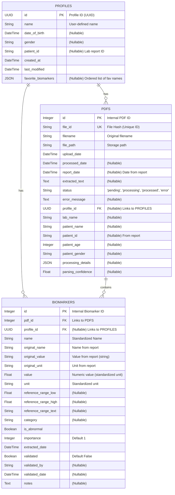

# Vein Diagram: Database Schema

This document describes the database schema used by the Vein Diagram application, based on the SQLAlchemy models.

## Entity Relationship Diagram (ERD)

## Table Descriptions

### `profiles` Table
*   **Purpose**: Stores information about individual user profiles (e.g., different family members). Allows associating lab reports and biomarkers with specific individuals.
*   **Primary Key**: `id` (UUID)
*   **Key Columns**:
    *   `name`: User-provided name for the profile.
    *   `date_of_birth`, `gender`, `patient_id`: Optional demographic information, potentially extracted from reports or entered by the user. `patient_id` can be a lab-specific identifier.
    *   `favorite_biomarkers`: JSON array storing an ordered list of favorite biomarker names for this profile.
*   **Relationships**:
    *   One-to-Many with `pdfs` (a profile can have multiple PDFs).
    *   One-to-Many with `biomarkers` (a profile can have multiple biomarker entries across different PDFs).

### `pdfs` Table
*   **Purpose**: Stores metadata about each uploaded PDF file and its processing status.
*   **Primary Key**: `id` (Integer, internal sequence).
*   **Unique Key**: `file_id` (String, SHA256 hash of the file content, used as the public identifier).
*   **Key Columns**:
    *   `filename`, `file_path`: Original filename and storage location.
    *   `upload_date`, `processed_date`: Timestamps for tracking.
    *   `status`: Tracks the processing state ('pending', 'processing', 'processed', 'error').
    *   `extracted_text`: Stores the raw text extracted by PyPDF2 or OCR.
    *   `lab_name`, `patient_name`, `patient_id`, `patient_age`, `patient_gender`, `report_date`: Metadata extracted from the PDF content (often via Claude).
    *   `parsing_confidence`: Average confidence score from Claude for biomarker extraction in this PDF.
*   **Relationships**:
    *   Many-to-One with `profiles` (`profile_id` Foreign Key, nullable). A PDF is associated with one profile (or none initially).
    *   One-to-Many with `biomarkers` (a PDF contains multiple biomarker entries). Cascade delete ensures biomarkers are deleted if the parent PDF is deleted.

### `biomarkers` Table
*   **Purpose**: Stores individual biomarker results extracted from the PDFs. This is the core data used for visualizations and analysis.
*   **Primary Key**: `id` (Integer, internal sequence).
*   **Key Columns**:
    *   `name`, `original_name`: Standardized and original biomarker names.
    *   `value`, `original_value`: Numeric value (in standardized unit) and original string value.
    *   `unit`, `original_unit`: Standardized and original units.
    *   `reference_range_low`, `reference_range_high`, `reference_range_text`: Parsed numeric range limits and original text.
    *   `category`: Assigned category (e.g., Lipid, Metabolic).
    *   `is_abnormal`: Boolean flag indicating if the value falls outside the reference range.
    *   `confidence`: Confidence score from Claude extraction (if applicable).
*   **Relationships**:
    *   Many-to-One with `pdfs` (`pdf_id` Foreign Key). Each biomarker belongs to one PDF.
    *   Many-to-One with `profiles` (`profile_id` Foreign Key, nullable). Each biomarker is associated with one profile (inherited from the PDF).

### `biomarker_dictionary` Table
*   **Purpose**: Acts as a reference table to help standardize biomarker names, units, categories, and potentially store general descriptions or reference ranges. It is used programmatically by the parsing services but not directly linked via foreign keys in the main data flow shown in the ERD.
*   **Primary Key**: `id` (Integer).
*   **Unique Key**: `standard_name`.
*   **Key Columns**:
    *   `standard_name`: The canonical name for the biomarker.
    *   `alternate_names`: JSON string list of other names this biomarker might appear as.
    *   `standard_unit`: The preferred unit for this biomarker.
    *   `unit_conversions`: JSON string defining conversion factors between units.
    *   `category`, `description`, `reference_ranges`: Additional reference information.

## Relationships Summary

-   A `Profile` can have many associated `PDF` files and many `Biomarker` entries.
-   A `PDF` belongs to one `Profile` (or none if unassigned) and contains many `Biomarker` entries.
-   A `Biomarker` belongs to one `PDF` and one `Profile`.
-   Deleting a `Profile` unlinks associated `PDFs` and `Biomarkers` (sets `profile_id` to NULL).
-   Deleting a `PDF` also deletes all its associated `Biomarkers` (due to `cascade="all, delete-orphan"`).
