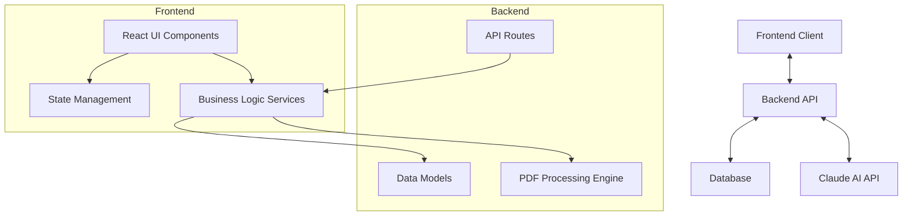
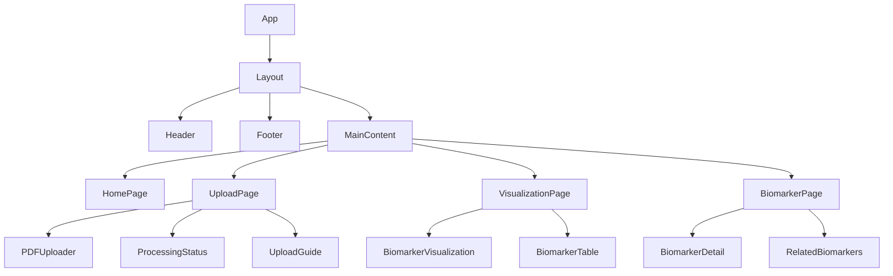
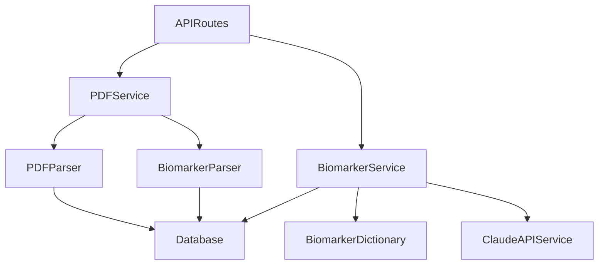
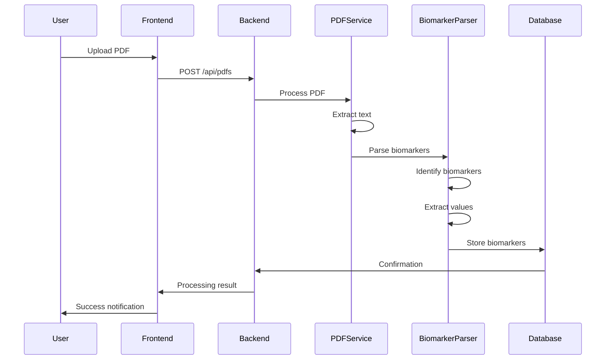
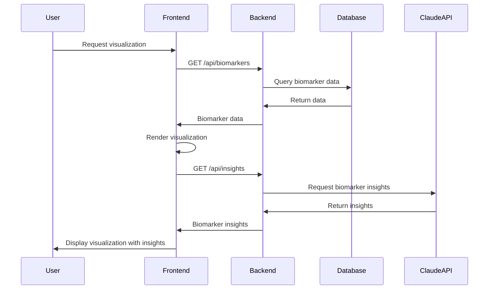

# Vein Diagram: System Patterns

## System Architecture

Vein Diagram follows a modern client-server architecture with clear separation of concerns:

### Frontend Architecture
- **React-based SPA**: Single-page application built with React and TypeScript
- **Component-based structure**: Modular UI components for maintainability
- **Client-side routing**: Navigation without full page reloads
- **API service layer**: Centralized API communication

### Backend Architecture
- **FastAPI framework**: Modern, high-performance Python web framework
- **Service-oriented design**: Business logic encapsulated in service modules
- **PDF processing pipeline**: Specialized components for extracting data from PDFs
- **Data persistence layer**: Database models and access patterns

## Key Technical Decisions

### Frontend
1. **React + TypeScript**: Type safety and improved developer experience
2. **Component Modularity**: Self-contained, reusable UI components
3. **Responsive Design**: Mobile-friendly interface using modern CSS techniques
4. **Data Visualization Libraries**: Specialized tools for rendering biomarker visualizations

### Backend
1. **FastAPI**: High performance, easy API documentation, and modern Python features
2. **PDF Processing Pipeline**: Specialized tools for extracting structured data from unstructured PDFs
3. **SQLAlchemy ORM**: Type-safe database interactions with migration support
4. **Claude API Integration**: AI-powered insights about biomarker relationships

### Cross-Cutting Concerns
1. **API-First Design**: Well-defined API contracts between frontend and backend
2. **Type Safety**: Strong typing in both frontend (TypeScript) and backend (Pydantic)
3. **Testing Strategy**: Unit and integration tests for critical components
4. **Development Workflow**: Local development environment with hot reloading

## Design Patterns in Use

### Frontend Patterns
1. **Component Composition**: Building complex UIs from simple, reusable components
2. **Container/Presentational Pattern**: Separating data fetching from presentation
3. **Custom Hooks**: Encapsulating and reusing stateful logic
4. **Render Props/Higher-Order Components**: Sharing component behavior

### Backend Patterns
1. **Repository Pattern**: Abstracting data access logic
2. **Service Layer**: Encapsulating business logic
3. **Dependency Injection**: Providing dependencies to components
4. **Factory Pattern**: Creating complex objects with specific configurations
5. **Pipeline Processing**: Sequential processing of PDF data extraction

## Component Relationships

### Frontend Component Hierarchy

### Backend Component Relationships

## Data Flow

### PDF Processing Flow

### Visualization Data Flow

