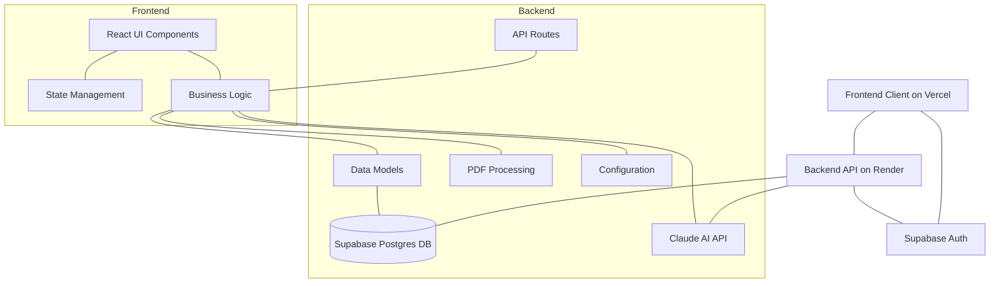
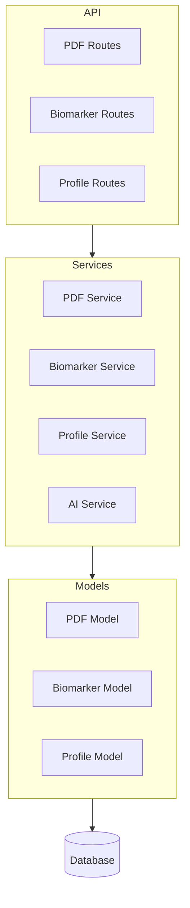
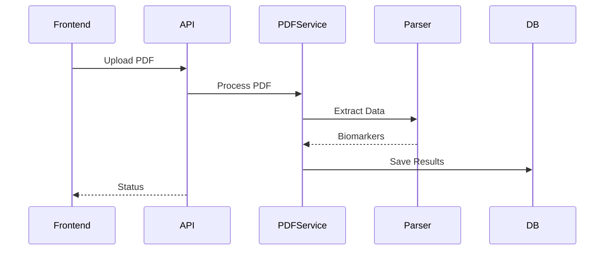
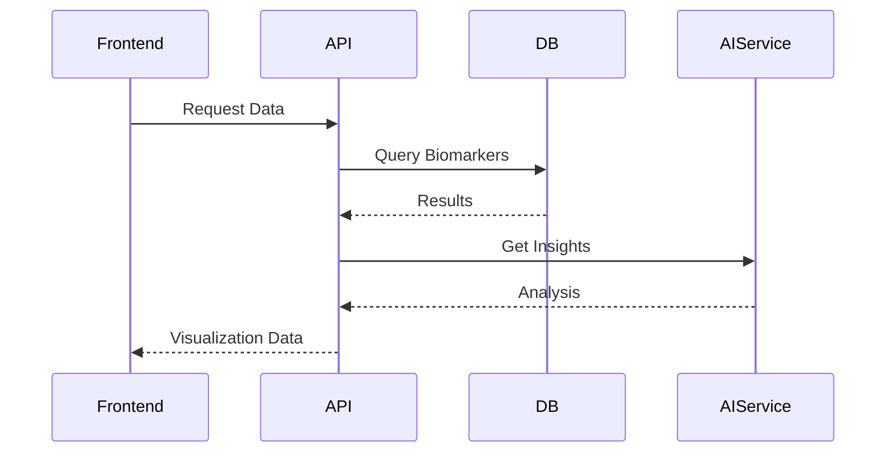
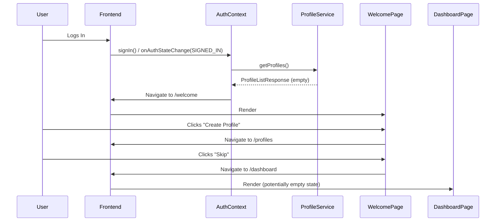

# Vein Diagram: System Patterns

## System Architecture

Vein Diagram follows a modern client-server architecture with clear separation of concerns, now incorporating user profiles:



### Frontend Architecture
- **React-based SPA**: Single-page application built with React and TypeScript.
- **Component-based structure**: Modular UI components for maintainability.
- **Client-side routing**: Navigation without full page reloads.
- **API service layer**: Centralized API communication (`profileService.ts`, etc.).
- **State Management**: Handling application state, including the **active user profile**.

### Backend Architecture
- **FastAPI framework**: Modern, high-performance Python web framework hosted on Render.
- **Service-oriented design**: Business logic encapsulated in service modules (e.g., `pdf_service.py`, `profile_service.py` - implicitly).
- **PDF processing pipeline**: Specialized components for extracting data from PDFs, now **linked to user profiles**.
- **Data persistence layer**: Uses **SQLAlchemy** ORM with **Supabase PostgreSQL** as the database. Models defined in `app/models/`. Migrations handled by **Alembic**.
- **Profile & Favorite Logic**: Specific services and routes handle profile CRUD and favorite biomarker management.

## Key Technical Decisions

### Frontend
1. **React + TypeScript**: Type safety and improved developer experience.
2. **Component Modularity**: Self-contained, reusable UI components.
3. **Responsive Design**: Mobile-friendly interface using modern CSS techniques.
4. **Data Visualization Libraries**: Specialized tools for rendering biomarker visualizations.
5. **State Management**: Using React Context API or similar for managing active profile state.

### Backend
1. **FastAPI**: High performance, easy API documentation, and modern Python features.
2. **PDF Processing Pipeline**: Specialized tools for extracting structured data from unstructured PDFs.
3. **SQLAlchemy ORM**: Type-safe database interactions with migration support.
4. **Claude API Integration**: AI-powered insights about biomarker relationships.
5. **Profile-Based Data**: Linking PDFs and favorites to user profiles.

### Cross-Cutting Concerns
1. **API-First Design**: Well-defined API contracts between frontend and backend.
2. **Type Safety**: Strong typing in both frontend (TypeScript) and backend (Pydantic).
3. **Testing Strategy**: Unit and integration tests for critical components, including profile/favorite logic.
4. **Development Workflow**: Local development environment with hot reloading.

## Design Patterns in Use

### Frontend Patterns
1. **Component Composition**: Building complex UIs from simple, reusable components (e.g., `BiomarkerTile.tsx`, `FavoriteBiomarkersGrid.tsx`).
2. **Container/Presentational Pattern**: Separating data fetching/logic (e.g., in pages like `ProfileManagement.tsx`) from presentation (e.g., reusable form components).
3. **Custom Hooks**: Encapsulating and reusing stateful logic (e.g., potentially `useProfile`, `useFavorites`).
4. **Context API (Potentially)**: For managing global state like the active user profile.
5. **Utility Functions**: Grouping reusable logic (`favoritesUtils.ts`, `biomarkerUtils.ts`).

### Backend Patterns
1. **Repository Pattern**: Abstracting data access logic.
2. **Service Layer**: Encapsulating business logic.
3. **Dependency Injection**: FastAPI's built-in DI for providing dependencies.
4. **Factory Pattern**: Creating complex objects with specific configurations.
5. **Pipeline Processing**: Sequential processing of PDF data extraction.

## Component Relationships

### Frontend Component Hierarchy

```mermaid
graph TD
    App --> AuthProvider[AuthProvider]
    AuthProvider --> ProfileProvider[ProfileProvider]
    ProfileProvider --> AppContent[AppContent]

    AppContent --> Layout
    Layout --> Header[Header]
    Layout --> Footer
    Layout --> MainContent

    MainContent --> DashboardPage
    MainContent --> UploadPage
    MainContent --> VisualizationPage
    MainContent --> ProfilePage
    MainContent --> WelcomePage[WelcomePage] %% Added Welcome Page

    DashboardPage --> BiomarkerGrid
    DashboardPage --> HealthScore
    DashboardPage --> Summary

    VisualizationPage --> Charts
    VisualizationPage --> Table
    VisualizationPage --> Filters

    ProfilePage --> ProfileForm
    ProfilePage --> BiomarkerPrefs
```

### Backend Component Relationships



## Data Flow

### PDF Processing Flow



### Visualization Flow



### Onboarding Flow (New User)


