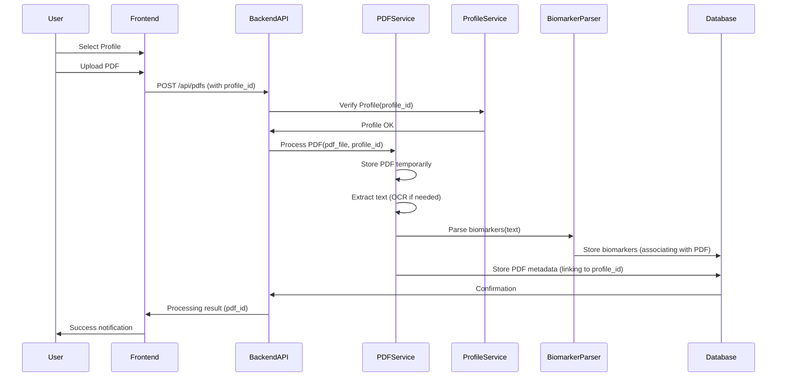

# Vein Diagram: System Patterns

## System Architecture

Vein Diagram follows a modern client-server architecture with clear separation of concerns, now incorporating user profiles:

```mermaid
graph TD
    Client[Frontend Client] <--> API[Backend API]
    API <--> DB[Database]
    API <--> Claude[Claude AI API]

    subgraph Frontend
        direction LR
        UI[React UI Components] --> State[State Management (Profile Context)]
        UI --> Services[API Services]
    end

    subgraph Backend
        direction LR
        Routes[API Routes] --> Services[Business Logic Services (incl. Profile/Favorite/HealthScore Logic)]
        Services --> Models[Data Models (incl. Profile/Favorite)]
        Services --> PDFProcessing[PDF Processing Engine]
        Services --> Config[Configuration (e.g., optimal_ranges.json)]
        Models --> DB
        Services --> Claude
    end
```

### Frontend Architecture
- **React-based SPA**: Single-page application built with React and TypeScript.
- **Component-based structure**: Modular UI components for maintainability.
- **Client-side routing**: Navigation without full page reloads.
- **API service layer**: Centralized API communication (`profileService.ts`, etc.).
- **State Management**: Handling application state, including the **active user profile**.

### Backend Architecture
- **FastAPI framework**: Modern, high-performance Python web framework.
- **Service-oriented design**: Business logic encapsulated in service modules (e.g., `pdf_service.py`, `profile_service.py` - implicitly).
- **PDF processing pipeline**: Specialized components for extracting data from PDFs, now **linked to user profiles**.
- **Data persistence layer**: Database models (`biomarker_model.py`, `pdf_model.py`, `profile_model.py`) and access patterns using SQLAlchemy.
- **Profile & Favorite Logic**: Specific services and routes handle profile CRUD and favorite biomarker management.

## Key Technical Decisions

### Frontend
1. **React + TypeScript**: Type safety and improved developer experience.
2. **Component Modularity**: Self-contained, reusable UI components.
3. **Responsive Design**: Mobile-friendly interface using modern CSS techniques.
4. **Data Visualization Libraries**: Specialized tools for rendering biomarker visualizations.
5. **State Management**: Using React Context API or similar for managing active profile state.

### Backend
1. **FastAPI**: High performance, easy API documentation, and modern Python features.
2. **PDF Processing Pipeline**: Specialized tools for extracting structured data from unstructured PDFs.
3. **SQLAlchemy ORM**: Type-safe database interactions with migration support.
4. **Claude API Integration**: AI-powered insights about biomarker relationships.
5. **Profile-Based Data**: Linking PDFs and favorites to user profiles.

### Cross-Cutting Concerns
1. **API-First Design**: Well-defined API contracts between frontend and backend.
2. **Type Safety**: Strong typing in both frontend (TypeScript) and backend (Pydantic).
3. **Testing Strategy**: Unit and integration tests for critical components, including profile/favorite logic.
4. **Development Workflow**: Local development environment with hot reloading.

## Design Patterns in Use

### Frontend Patterns
1. **Component Composition**: Building complex UIs from simple, reusable components (e.g., `BiomarkerTile.tsx`, `FavoriteBiomarkersGrid.tsx`).
2. **Container/Presentational Pattern**: Separating data fetching/logic (e.g., in pages like `ProfileManagement.tsx`) from presentation (e.g., reusable form components).
3. **Custom Hooks**: Encapsulating and reusing stateful logic (e.g., potentially `useProfile`, `useFavorites`).
4. **Context API (Potentially)**: For managing global state like the active user profile.
5. **Utility Functions**: Grouping reusable logic (`favoritesUtils.ts`, `biomarkerUtils.ts`).

### Backend Patterns
1. **Repository Pattern**: Abstracting data access logic.
2. **Service Layer**: Encapsulating business logic.
3. **Dependency Injection**: FastAPI's built-in DI for providing dependencies.
4. **Factory Pattern**: Creating complex objects with specific configurations.
5. **Pipeline Processing**: Sequential processing of PDF data extraction.

## Component Relationships

### Frontend Component Hierarchy (Simplified Example)
```mermaid
graph TD
    App --> Layout
    Layout --> Header(Header - incl. Profile Selector?)
    Layout --> Footer
    Layout --> MainContent

    subgraph MainContent
        direction LR
        UploadPage[Upload Page (Select Profile)]
        VisualizationPage[Visualization Page (Profile Context)]
        HistoryPage[Biomarker History Page (Profile Context)]
        ProfileMgmtPage[Profile Management Page]
    end

    ProfileMgmtPage --> ProfileList
    ProfileMgmtPage --> ProfileForm

    VisualizationPage --> FavoriteBiomarkersGrid
    VisualizationPage --> BiomarkerVisualization(Biomarker Visualization)
    VisualizationPage --> BiomarkerTable(Biomarker Table - Add/Remove Fav)

    FavoriteBiomarkersGrid --> BiomarkerTile(Biomarker Tile - Add/Remove Fav)
    FavoriteBiomarkersGrid --> AddBiomarkerTile --> AddFavoriteModal

    UploadPage --> PDFUploader
```

### Backend Component Relationships (Simplified Example)
```mermaid
graph TD
    subgraph API_Routes
        direction LR
        PDFRoutes[pdf_routes.py]
        BiomarkerRoutes[biomarker_routes.py]
        ProfileRoutes[profile_routes.py]
        HealthScoreRoutes[health_score_routes.py]
    end

    subgraph Services
        direction LR
        PDFService[pdf_service.py]
        BiomarkerService[biomarker_service.py (implicit)]
        ProfileService[profile_service.py (implicit)]
        HealthScoreService[health_score_service.py (implicit)]
        LLMService[llm_service.py]
    end

    subgraph Parsers
        direction LR
        BiomarkerParser[biomarker_parser.py]
        MetadataParser[metadata_parser.py]
    end

    subgraph Models
        direction LR
        PDFModel[pdf_model.py]
        BiomarkerModel[biomarker_model.py]
        ProfileModel[profile_model.py]
    end

    API_Routes --> Services
    Services --> Parsers
    Services --> LLMService
    Services --> Models
    Parsers --> Models
    Models --> Database[(Database)]

    PDFRoutes --> PDFService
    BiomarkerRoutes --> BiomarkerService
    ProfileRoutes --> ProfileService

    PDFService --> BiomarkerParser
    PDFService --> MetadataParser
    PDFService --> ProfileService # To link PDF to profile
    BiomarkerService --> LLMService # For insights
    ProfileService --> Models # Profile CRUD
    BiomarkerService --> Models # Favorite management
    HealthScoreRoutes --> HealthScoreService
    HealthScoreService --> Models # Needs biomarker data
    HealthScoreService --> Config # Needs optimal ranges
```

## Data Flow

### PDF Processing Flow (with Profile)


### Visualization Data Flow (with Profile)
```mermaid
sequenceDiagram
    participant User
    participant Frontend
    participant BackendAPI
    participant Database
    participant LLMService

    User->>Frontend: Select Profile
    User->>Frontend: Navigate to Visualization Page
    Frontend->>BackendAPI: GET /api/profiles/{profile_id}/biomarkers
    BackendAPI->>Database: Query biomarker data for profile_id
    Database->>BackendAPI: Return data
    BackendAPI->>Frontend: Biomarker data (filtered by profile)
    Frontend->>Frontend: Render visualization
    Frontend->>BackendAPI: GET /api/profiles/{profile_id}/favorites
    BackendAPI->>Database: Query favorite biomarkers for profile_id
    Database->>BackendAPI: Return favorites list
    BackendAPI->>Frontend: Favorite biomarkers data
    Frontend->>Frontend: Highlight/display favorites
    Frontend->>BackendAPI: GET /api/biomarkers/{biomarker_name}/insights
    BackendAPI->>LLMService: Request biomarker insights
    LLMService->>BackendAPI: Return insights
    BackendAPI->>Frontend: Biomarker insights
    Frontend->>User: Display visualization with insights & favorites
